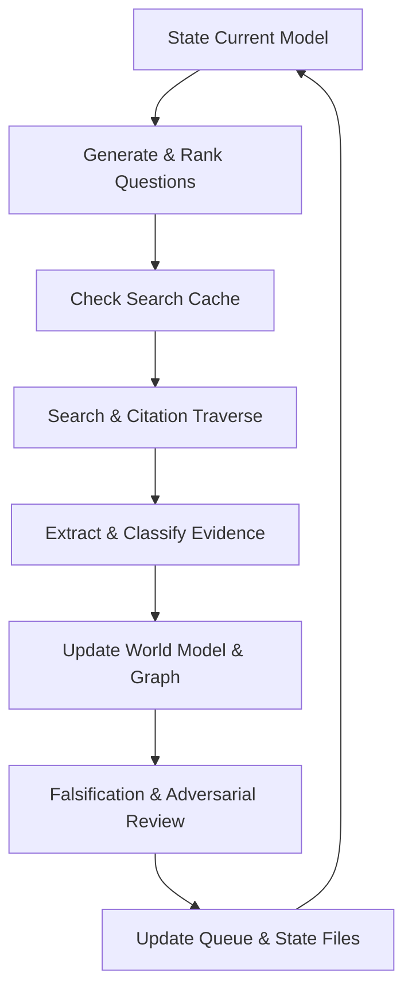

# Autonomous Pica Mechanism Research

An iterative biomedical literature-research system and protocol for Gemini / Antigravity to investigate the biological mechanisms of **Pica**.

## Mission & Goal

Go beyond summarizing literature. Build a mechanistic evidence graph, connect Pica to adjacent biological fields, actively search for contradictions, identify missing causal links, and generate falsifiable hypotheses that survive adversarial peer review.

## Architecture & Layout

```
.
├── .agents/
│   ├── hooks.json                # Antigravity lifecycle hooks configuration
│   └── hooks/
│       └── research_gate.py      # PreInvocation and Stop gate enforcer
├── research/
│   └── SEARCH_POLICY.md          # Token-efficient search escalation policy
├── state/                        # Persistent disk-backed state files
│   ├── world-model.md            # Verified literature consensus & mechanistic map
│   ├── hypothesis-pool.md        # Competing hypotheses (N0–N4) & predictions
│   ├── uncertainty-map.md        # Anomalies, contradictions, and evidence gaps
│   ├── research-queue.md         # Prioritized next investigations
│   ├── dead-ends.md              # Falsified/rejected hypotheses & decisive evidence
│   └── search-cache.md           # Query cache to prevent redundant literature searches
├── tests/
│   └── test_hooks.py             # Automated unit tests for lifecycle enforcement
├── GEMINI.md                     # Complete autonomous research system prompt
└── README.md                     # Project documentation
```

## Core Research Loop



## Initial Biological Intersections

- **Pica × Iron deficiency & hypoxia:** Cellular hypoxia, non-heme iron sensing, and systemic homeostasis.
- **Pica × Nutrient-specific appetite:** Hypothalamic appetite circuits and selective micronutrient drives.
- **Pica × Gut-brain & vagal signaling:** Enteric sensory cells, vagus nerve afferents, and GI barrier integrity.
- **Geophagy × GI inflammation & microbiome:** Cation adsorption, clay surface binding, mucosal protection, and toxin sequestration.
- **Pagophagia × Neuromodulation:** Cold/tactile trigeminal activation, locus coeruleus norepinephrine release, and cerebral blood flow enhancement.
- **Iron × Dopamine/reward circuitry:** Striatal D2 receptor changes and compulsive/appetitive reinforcement.
- **Cross-species models:** Differentiating rodent kaolin ingestion (visceral malaise/nausea surrogate in non-emetic species) from human deficiency-driven pica.

## Running Tests

Verify the lifecycle enforcement hooks and state validation:

```bash
python3 -m unittest discover -s tests
```

See `GEMINI.md` for the full operational protocol.
