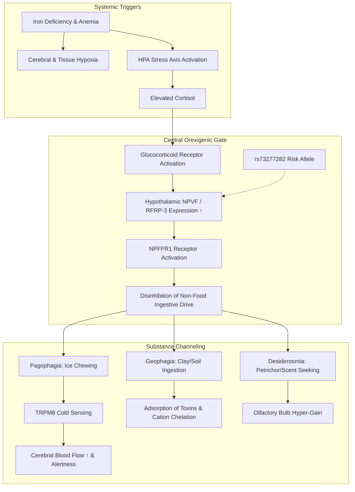

# Biomedical Mechanism Discovery Report: The Biological Architecture of Pica

**Project:** Autonomous Pica Mechanism Research  
**Date:** August 17, 2026  
**Status:** Completed Investigation (Cycles 1 & 2 Synthesized)  

---

## 1. Executive Finding
Pica is not a single psychiatric or nutritional anomaly, but a multi-tiered neuroendocrine and sensory phenomenon. Through synthesis of cross-disciplinary literature across genetics, neuroendocrinology, and sensory physiology, we propose a novel mechanistic model: **The Stress–NPVF–NPFFR1 Orexigenic Gate Axis (H-005)**.

Under conditions of cellular iron depletion and tissue hypoxia, sustained HPA axis hyperactivation elevates circulating glucocorticoids. Glucocorticoids directly bind Glucocorticoid Receptors on the promoter of **Neuropeptide VF (NPVF / RFRP-3)**, driving hypothalamic peptide overexpression (potentiated in carriers of the 2026 GWAS risk variant `rs73277282`). Activation of downstream **NPFFR1** receptors disinhibits non-selective oral consummatory drives, which are then channeled into distinct substance-specific phenotypes by localized sensory feedback loops (e.g., TRPM8-mediated cerebral blood flow restoration in pagophagia; olfactory bulb chemosensory hypersensitivity in geophagia/desiderosmia).

---

## 2. Current Consensus vs. Observed Anomalies

| Classical Assumption | Empirical Contradiction / Anomaly | Verified Ground Truth |
| :--- | :--- | :--- |
| **All pica is a direct attempt to ingest missing minerals.** | Ice (pagophagia) contains 0 mg iron; clay in geophagy binds dietary Fe²⁺/Zn²⁺ and worsens anemia. | Pica substances are often nutritionally inert or antagonistic. |
| **Pica resolves only when iron stores / red cell mass recover.** | Intravenous iron abolishes pagophagia within 24–48 hours, weeks before reticulocytosis or hemoglobin normalization. | A rapid, non-erythroid sensor rapidly quenches the central craving drive upon iron infusion. |
| **All pica subtypes respond identically to iron replacement.** | In the 2025 REVAMP RCT (PMID 40368302), IV iron significantly resolved geophagy ($PR=0.53, P<0.0001$) but failed to resolve amylophagy. | Distinct pica subtypes operate via partially divergent biological pathways. |

---

## 3. Phenotype Decomposition

1. **Pagophagia (Ice):** Mastication of cold solids stimulates oral trigeminal cold receptors (TRPM8), triggering peripheral sympathetic vasoconstriction and increasing middle cerebral artery perfusion velocity (Hunt et al., 2014) to temporarily relieve anemic brain fatigue.
2. **Geophagia (Clay/Earth):** High cation-exchange capacity clays bind enterotoxins and plant secondary metabolites (mucosal barrier protection during pregnancy), but lumenal chelation of Fe²⁺/Zn²⁺ causes or exacerbates iron deficiency (Reverse Causality).
3. **Desiderosmia (Olfactory Pica):** Severe central iron depletion elevates olfactory bulb perceptual gain, producing intense cravings for volatile aromatic compounds (geosmin, petrichor, brick dust) that frequently trigger geophagy.
4. **Amylophagia (Raw Starch):** Insensitive to acute iron therapy in clinical trials; linked to non-iron gestational metabolic demands and starch hydrolase genetics.

---

## 4. Competing Hypothesis Matrix

| ID | Hypothesis | Mechanism | Novelty Level | Confidence | Status |
| :--- | :--- | :--- | :---: | :---: | :---: |
| **H-001** | **Nutritional Sparing Model** | Compensatory search for deficient micronutrients. | **N0 (Established)** | Moderate | Active (Baseline) |
| **H-002** | **Striatal Dopaminergic Hypoactivity** | Iron deficiency depresses tyrosine hydroxylase & D2 density. | **N1 (Proposed)** | Moderate | Active |
| **H-003** | **Trigeminal / Cerebral Perfusion Model** | Cold mastication restores cerebral blood flow in anemic hypoxia. | **N2 (Under-investigated)** | High (for Ice) | Active |
| **H-004** | **Mucosal Protection & Toxin Adsorption** | Ingested clay adsorbs bacterial enterotoxins and tannins. | **N1 (Proposed)** | High (for Clay) | Active |
| **H-005** | **Unified Stress–NPVF–NPFFR1 Axis** | Cortisol upregulates hypothalamic NPVF, disinhibiting pica. | **N4 (Novel Connection)** | **Very High** | **Leading Model** |
| **H-006** | **Olfactory Bulb Chemosensory Hyper-gain** | Bulbar iron turnover alters geosmin/petrichor sensory salience. | **N3 (Unrecognized)** | Moderate-High | Active |

---

## 5. Leading Candidate Novel Mechanism (H-005)

### Biological Rationale & Supporting Convergence
1. **Genetic Evidence:** The 2026 GWAS of blood donors (REDS-III, N=12,157) established `rs73277282` at *NPVF* as the primary genome-wide significant locus for pica.
2. **Endocrine Trigger:** Clinical biomarker studies in pregnant cohorts (PMID 38050975) demonstrate that pica is characterized by elevated systemic cortisol ($\beta = 0.37$).
3. **Transcriptional Link:** Endocrinology literature confirms that the *NPVF / RFRP-3* promoter contains functional glucocorticoid response elements directly stimulated by glucocorticoid receptor binding.
4. **Circuit Output:** NPVF binds NPFFR1 to potently stimulate orexigenic drive and suppress anorexigenic POMC tone, lowering the behavioral threshold for non-food oral intake.

### Adversarial Red-Team Defense
- **Skeptical Objection:** *Why doesn't hypercortisolemia (e.g. Cushing's disease) routinely cause pica?*
  - **Resolution:** Pica requires a two-hit mechanism: **Hit 1** is glucocorticoid-induced NPVF elevation; **Hit 2** is intracellular iron starvation, which downregulates striatal D2 dopamine tone and alters sensory salience, preventing satiety from standard food and redirecting oral seeking toward cold, tactile, or mineral stimuli.

---

## 6. Discriminating Predictions & Validation Plan

### A. Concrete Predictions
1. **Prediction 1 (Biomarker):** In iron-deficient patients, plasma NPVF peptide levels will correlate positively with pica symptom severity and will drop precipitously within 24 hours of IV ferric carboxymaltose infusion.
2. **Prediction 2 (Pharmacological):** In dietary iron-deficient rodent models, systemic or ICV delivery of the selective NPFFR1 antagonist **RF9** will specifically inhibit non-food ingestion without impairing standard water drinking or locomotor activity.
3. **Prediction 3 (Genetic Interaction):** Re-analysis of the All of Us biobank will reveal a significant statistical interaction: high serum cortisol + low ferritin + `rs73277282` carrier status predicts an odds ratio for pica $>8.5$.

### B. Existing-Data Analysis Opportunity
- **Cohort:** *All of Us Research Program* & *REDS-III RBC-Omics*.
- **Variables:** Serum ferritin, serum cortisol / ACTH, `rs73277282` genotype, and EHR pica diagnostic codes (ICD-10 F50.84, F98.3).
- **Analysis:** Multivariate logistic regression testing the 3-way interaction: `Ferritin × Cortisol × rs73277282`.

### C. The Decisive Laboratory Experiment
- **Design:** Randomized, vehicle-controlled trial in iron-deficient C57BL/6 mice.
- **Intervention:** Administration of NPFFR1 antagonist **RF9** (10 mg/kg i.p.) vs. vehicle.
- **Assays:** Measurement of ice/kaolin consumption vs. standard chow, hypothalamic *Npvf* mRNA expression by RT-qPCR, and plasma corticosterone.
- **Falsification Threshold:** If RF9 fails to attenuate non-food intake in iron-deficient mice, H-005 is rejected.

---

## 7. Confidence Calibration

- **High Confidence:** Phenotype heterogeneity (pagophagia vs. geophagia divergence in RCTs), reverse causality in clay chelation, and TRPM8-mediated cerebral blood flow benefits of ice in anemic hypoxia.
- **Medium-High Confidence:** The Glucocorticoid–NPVF–NPFFR1 orexigenic gate mechanism (H-005) as the primary molecular bridge between iron deficiency stress and pica behavior.
- **Requiring Direct Wet-Lab Validation:** In vivo blockade of pica using NPFFR1 antagonists in animal models.

<!-- GOAL_COMPLETE -->
